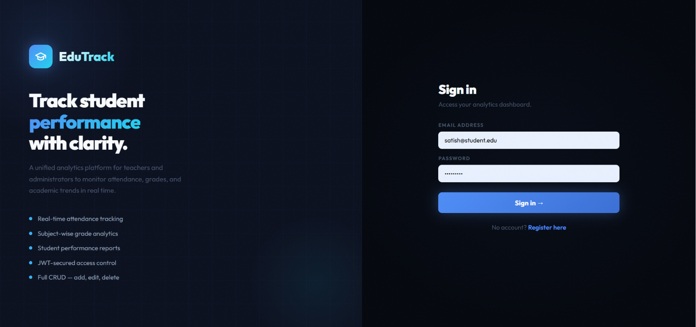
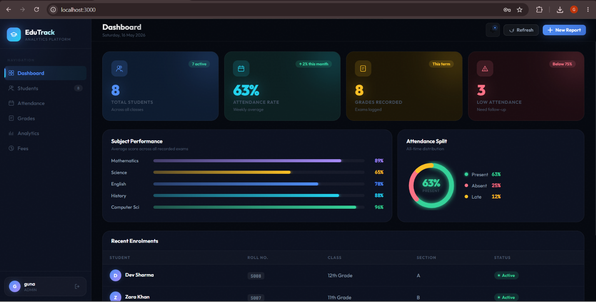

# EduTrack – Student Management System

EduTrack is a full-stack student management system built using React, Java Spring Boot, REST APIs, and MySQL. The project helps manage student records, attendance, grades, fee details, and dashboard analytics through a responsive web interface.

## Live Demo

[View Live Project](https://edu-track-student-analytics.vercel.app)

## Project Screenshot

## Source Code

[View GitHub Repository](https://github.com/gunashree51/EduTrack-Student-Analytics)

## Project Overview

EduTrack provides a centralized platform for managing student-related academic data. It allows users to register, log in, manage students, mark attendance, record grades, manage fees, and view dashboard insights.

The application follows a full-stack architecture where the React frontend communicates with the Spring Boot backend using REST APIs. The backend is connected to a cloud-hosted MySQL database, so the data remains saved even after refreshing, logging out, or logging in again.

## Features

- User registration and login
- JWT-based authentication
- Student profile management
- Add, update, view, and delete student records
- Attendance marking and tracking
- Grade and marks management
- Fee record management
- Dashboard with student, attendance, grade, and fee insights
- Cloud database storage
- Responsive user interface

## Tech Stack

### Frontend
- React.js
- Vite
- JavaScript
- HTML5
- CSS3

### Backend
- Java
- Spring Boot
- Spring Security
- REST APIs
- JWT Authentication
- Hibernate / JPA

### Database
- MySQL
- Aiven Cloud MySQL

### Deployment
- Frontend: Vercel
- Backend: Render
- Database: Aiven

## System Architecture

React Frontend deployed on Vercel communicates with the Spring Boot backend deployed on Render using REST APIs. The backend stores and retrieves data from an Aiven Cloud MySQL database.

## Modules

### Authentication
Users can register and log in securely using JWT-based authentication.

### Students
Users can add, view, update, and delete student details.

### Attendance
Users can mark and manage attendance records.

### Grades
Users can add and manage student marks, exam type, subject, grade, and academic year.

### Fees
Users can manage fee records including fee type, amount, paid amount, due date, month, and payment status.

### Dashboard
The dashboard displays overall insights such as total students, attendance rate, grades recorded, and recent student enrollments.

## Deployment Details

- Frontend is deployed on Vercel.
- Backend Spring Boot API is deployed on Render.
- MySQL database is hosted on Aiven Cloud.
- Environment variables are used to keep database credentials secure.

## Future Enhancements

- Add password reset functionality
- Add advanced analytics and reports
- Add export to PDF or Excel
- Add role-based dashboards for admin and teacher
- Add notification system for pending fees and low attendance

## Author

**Gunashree S**

- GitHub: [gunashree51](https://github.com/gunashree51)
- Project: EduTrack – Student Management System
